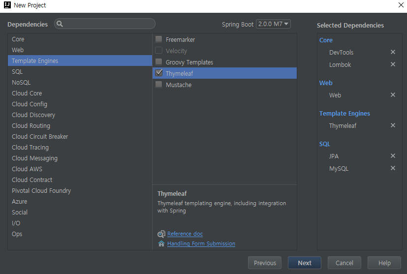

## 06 Spring MVC를 이용한 통합

- <a href="#init"> Init </a>


<div id="init"></div>

### Init

> Project init



> Thymeleaf layout

```
<dependency>
    <groupId>nz.net.ultraq.thymeleaf</groupId>
    <artifactId>thymeleaf-layout-dialect</artifactId>
    <version>2.2.2</version>
</dependency>
```

> application.properties

```
spring.datasource.driver-class-name=com.mysql.jdbc.Driver
spring.datasource.url=jdbc:mysql://localhost:3306/jpa_ex?useSSL=false
spring.datasource.username=jpa_user
spring.datasource.password=jpa_user

spring.jpa.hibernate.ddl-auto=update
spring.jpa.generate-ddl=true
spring.jpa.show-sql=true
spring.jpa.database=mysql
spring.jpa.database-platform=org.hibernate.dialect.MySQL5InnoDBDialect

logging.level.org.hibernate=info

spring.thymeleaf.cache=false

logging.level.org.springframework.web=info
logging.level.org.zerock=info
```

> bootstrap cdn

> Controller, Domain , Repository 작성

> Querydsl 설정

```
<dependency>
    <groupId>com.querydsl</groupId>
    <artifactId>querydsl-apt</artifactId>
    <scope>provided</scope>
</dependency>

<dependency>
    <groupId>com.querydsl</groupId>
    <artifactId>querydsl-jpa</artifactId>
</dependency>

...

<plugin>
    <groupId>com.mysema.maven</groupId>
    <artifactId>apt-maven-plugin</artifactId>
    <version>1.1.3</version>
    <executions>
        <execution>
			<goals>
                <goal>process</goal>
            </goals>
            <configuration>
                <outputDirectory>target/generated-sources/java</outputDirectory>
                <processor>com.querydsl.apt.jpa.JPAAnnotationProcessor</processor>
            </configuration>
        </execution>
    </executions>
</plugin>

```

> Board CRUD

- Controller ::
<a href="https://github.com/zacscoding/spring-boot-example/tree/master/book/start-spring-boot/boot06/src/main/java/org/zerock/controller/WebBoardController.java">WebBoardController</a>


- Persistence ::
<a href="https://github.com/zacscoding/spring-boot-example/tree/master/book/start-spring-boot/boot06/src/main/java/org/zerock/persistence/WebBoardRepository.java">WebBoardRepository</a>

- Domain ::
<a href="https://github.com/zacscoding/spring-boot-example/tree/master/book/start-spring-boot/boot06/src/main/java/org/zerock/domain/WebBoard.java">WebBoard</a>

- DTO ::
  + <a href="https://github.com/zacscoding/spring-boot-example/tree/master/book/start-spring-boot/boot06/src/main/java/org/zerock/vo/PageMaker.java">PageMaker</a>
  + <a href="https://github.com/zacscoding/spring-boot-example/tree/master/book/start-spring-boot/boot06/src/main/java/org/zerock/vo/PageVO.java">PageVO</a>

- Views ::
<a href="https://github.com/zacscoding/spring-boot-example/tree/master/book/start-spring-boot/src/main/resources/templates">templates</a>


---


## ch07 REST 방식의 댓글 처리 + JPA 처리

- Controller :: <a href="https://github.com/zacscoding/spring-boot-example/blob/master/book/start-spring-boot/boot06/src/main/java/org/zerock/controller/WebReplyController.java">WebReplyController</a>
- Persistence ::
  - <a href="https://github.com/zacscoding/spring-boot-example/blob/master/book/start-spring-boot/boot06/src/main/java/org/zerock/persistence/ReplyRepository.java">ReplyRepository</a>
  - <a href="https://github.com/zacscoding/spring-boot-example/tree/master/book/start-spring-boot/boot06/src/main/java/org/zerock/persistence">CustomWebBoard, CustomCrudRepository, CustomCrudRepositoryImpl</a>
- Domain :: <a href="https://github.com/zacscoding/spring-boot-example/blob/master/book/start-spring-boot/boot06/src/main/java/org/zerock/domain/WebReply.java">WebReply</a>
- Views ::
  - <a href="https://github.com/zacscoding/spring-boot-example/blob/master/book/start-spring-boot/boot06/src/main/resources/static/js/reply.js">reply.js</a>
  - <a href="https://github.com/zacscoding/spring-boot-example/blob/master/book/start-spring-boot/boot06/src/main/resources/templates/boards/view.html">view.html</a>


> update reply table

```
Hibernate: create table tbl_webreplies (bno bigint not null auto_increment, regdate datetime, reply_text varchar(255), replyer varchar(255), updatedate datetime, board_bno bigint, primary key (bno)) engine=InnoDB
Hibernate: alter table tbl_webreplies add constraint FKoqessctbkmr17s2vyoy825r2s foreign key (board_bno) references tbl_webboards (bno)
```


#### N+1 검색 문제

> WebBoard.java

```
...
public class WebBoard {
  ...
  @OneToMany(mappedBy = "board", fetch=FetchType.LAZY)
  private List<WebReply> replies;
}

-> list query

Hibernate: select webboard0_.bno as bno1_0_, webboard0_.content as content2_0_, webboard0_.regdate as regdate3_0_, webboard0_.title as title4_0_, webboard0_.updatedate as updateda5_0_, webboard0_.writer as writer6_0_ from tbl_webboards webboard0_ where webboard0_.bno>? order by webboard0_.bno desc limit ?
Hibernate: select count(webboard0_.bno) as col_0_0_ from tbl_webboards webboard0_ where webboard0_.bno>?

Hibernate: select replies0_.board_bno as board_bn6_1_0_, replies0_.rno as rno1_1_0_, replies0_.rno as rno1_1_1_, replies0_.board_bno as board_bn6_1_1_, replies0_.regdate as regdate2_1_1_, replies0_.reply_text as reply_te3_1_1_, replies0_.replyer as replyer4_1_1_, replies0_.updatedate as updateda5_1_1_ from tbl_webreplies replies0_ where replies0_.board_bno=?
X10
```

##### SOl1) @Query

> WebBoardRepository.java

```
@Query("SELECT b.bno, b.title, b.writer, b.regdate, count(r) FROM WebBoard b"
      + "LEFT OUTER JOIN b.replies r WHERE b.bno > 0 GROUP BY b")
```

> Test Code

```
Pageable pageable = PageRequest.of(0, 10, Direction.DESC, "bno");
List<Object[]> list = WebBoardRepository.getListWithQuery(pageable);
list.forEach(arr -> log.info(Arrays.toString(arr)));
```

> 문제점 : JPQL의 내용이 고정

=> 동적으로 변하는 상황에 대한 처리가 어려움  
(검색 조건에 대한 처리 등 상황에 따라 달라지는 검색 조건일 때)
=> @Query는 프로젝트의 로딩 시점에서 JQPL의 적합성을 검사하기 때문에 쉽지 않음  
=> 각 상황에 맞게, 메소드를 작성 하면 가능은 하지만, 비효율적임

```
@Query(...)
public Page<Object[]> getListWithAll(Pageable pageable);

@Query(...)
public Page<Object[]> getListWithTitle(String keyword);

@Query(...)
public Page<Object[]> getListWithWriter(String keyword);
...
```

##### SOl2) 동적으로 JPQL 처리
; 사용자가 직접 Repository를 조절하는 방식을 이용

- 원하는 기능을 별도의 사용자 정의 인터페이스(CustomWebBoard)로 설계
- 엔티티의 Repository 인터페이스를 설게할 때 사용자 정의 인터페이스 역시 같이 상속하도록 설계(CustomCrudRepository)
- 엔티티 Repository를 구현하는 클래스를 생성. 이때 반드시 'Repository 이름'+'impl' 클래스로 지정  
(클래스 생성 시에 부모 클래스를 QuerydslRepositorySupport로 지정 )
- Repository 인터페이스 Impl 클래스에 JPQLQuery 객체를 이용해서 내용 작성

> 사용자 정의 인터페이스 설계

```
package org.zerock.persistence;

import org.springframework.data.domain.Page;
import org.springframework.data.domain.Pageable;

public interface CustomWebBoard {
    public Page<Object[]> getCustomPage(String type, String keyword, Pageable pageable);
}
```

> 엔티티의 Repository 인터페이스 설계

```
package org.zerock.persistence;

import org.springframework.data.repository.CrudRepository;
import org.zerock.domain.WebBoard;

public interface CustomCrudRepository extends CrudRepository<WebBoard,Long>, CustomWebBoard {
}
```

> 사용자 정의 인터페이스의 구현

```
package org.zerock.persistence;

import com.querydsl.core.Tuple;
import com.querydsl.jpa.JPQLQuery;
import lombok.extern.java.Log;
import org.springframework.data.domain.Page;
import org.springframework.data.domain.PageImpl;
import org.springframework.data.domain.Pageable;
import org.springframework.data.jpa.repository.support.QuerydslRepositorySupport;
import org.zerock.domain.QWebBoard;
import org.zerock.domain.QWebReply;
import org.zerock.domain.WebBoard;

import java.util.ArrayList;
import java.util.List;

@Log
public class CustomCrudRepositoryImpl extends QuerydslRepositorySupport implements CustomWebBoard {
    public CustomCrudRepositoryImpl () {
        super(WebBoard.class);
    }
    @Override
    public Page<Object[]> getCustomPage(String type, String keyword, Pageable pageable) {
      ...
    }          
```

> JPQLQuery 객체를 이용해서 내용 작성 (CustomCrudRepositoryImpl.java)

```
@Override
    public Page<Object[]> getCustomPage(String type, String keyword, Pageable pageable) {
        log.info("==================");
        log.info("TYPE : " + type);
        log.info("KEYWORD : " + keyword);
        log.info("PAGE : " + pageable);
        log.info("==================");

        QWebBoard b = QWebBoard.webBoard;
        QWebReply r = QWebReply.webReply;

        JPQLQuery<WebBoard> query = from(b);

        // select query
        JPQLQuery<Tuple> tuple = query.select(b.bno, b.title, r.count(), b.writer, b.regdate);
        tuple.leftJoin(r);
        tuple.on(b.bno.eq(r.board.bno));
        tuple.where(b.bno.gt(0));

        // search
        if(type != null) {
            switch(type.toLowerCase()) {
                case "t" :
                    tuple.where(b.title.like("%" + keyword + "%"));
                    break;
                case "c" :
                    tuple.where(b.content.like("%" + keyword + "%"));
                    break;
                case "w" :
                    tuple.where(b.writer.like("%" + keyword + "%"));
                    break;
            }
        }

        tuple.groupBy(b.bno);
        tuple.orderBy(b.bno.desc());

        // pagination
        tuple.offset(pageable.getOffset());
        tuple.limit(pageable.getPageSize());

        // result
        List<Tuple> list = tuple.fetch();
        List<Object[]> resultList = new ArrayList<>();
        list.forEach( t -> {
            resultList.add(t.toArray());
        });

        long total = tuple.fetchCount();

        return new PageImpl<>(resultList, pageable, total);
    }
```
