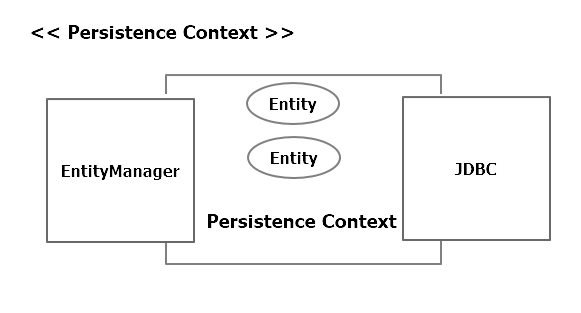

# JPA(Java Persistence API)

[move to learn.md](https://github.com/zacscoding/spring-boot-example/blob/master/book/start-spring-boot/learn.md)

docs
- [spring getting started](https://spring.io/guides/gs/accessing-data-jpa/)
-

index  
- <a href="archi">JPA archi</a>
- <a href="advantage">JPA 장단점</a>
- <a href="entity">엔티티, 엔티티매니저</a>
- <a href="annotation">Annotation</a>
- <a href="data-page">Spring Data Page </a>

> ORM (Object Relation Mapping) ?

<pre>
객체지향과 관계형 데이터베이스를 매핑 시킨다는 추상화 된 개념(vision?)  
-> JPA는 ORM의 개념을 Java 언어에서 구현하기 위한 스팩
</pre>

---

### JPA Archi

---

### JPA 장단점

***장점***  

- 데이터 베이스 관련 코드에 대한 유연함을 얻을 수 있음  
=> DB 변경은 프로그램 많이 바뀜 (DAO,VO, 화면, 서비스 등등)  
=> JPA는 DB 설계부터 Java 설계를 한번에 처리 가능

- 데이터베이스와 독립적 관계  
=> 특정 벤더의 데이터베이스에 종속적이지 않음(JPA에서 지원)  

***단점***  

- 학습 곡선(learning curve)이 큼
- 근본적인 객체지향 설계 사상이 반영되어야 함  
=> 어떻게 적합한 객체들의 관계를 작성 할 것인 가? 가 관건
- 특정 데이터베이스의 강력함을 활용할 수 없다는 문제  
=> SQL 튜닝 등의 작업에 제약이 생길 수 있음  
=> Native SQL을 제공하지만, DB와 종속적인 관계인 장점을 잃는 한계 등등

즉 **Application <-> JPA <->  JDBC <-> Database**

---

### 엔티티(Entity), 엔티티 매니저(Entity Manager)

#### Entity

> Member (Entity Type)

<table>
  <tr>
    <th>아이디</th><th>이름</th><th>연락처</th><th><< 컬럼/속성</th>
  </tr>
  <tr>
    <td>user01</td><td>name01</td><td>010-111-11111</td><td></td>
  </tr>
</table>

=> JPA에서 '하나의 엔티티 타입 생성 => 하나의 클래스를 작성'  
=> 회원 엔티티 == 회원 엔티티 클래스 || 회원 엔티티 인스턴스(객체) 혼용해서 사용 됨  

#### Entity Manager
; 여러 엔티티 객체를 관리

> Entity Object Life Cycle

[pic ref](https://vladmihalcea.com/2014/07/30/a-beginners-guide-to-jpa-hibernate-entity-state-transitions/)

- **New(비영속)**  
: Java 영역의 객체만 존재 & Database와 연동된 적이 없는 상태.  
(엔티티 매니저의 관리하에 있는 것이 아니므로 순수 Java 객체)  
- **Managed(영속)**  
: Database에 저장 & 메모리상에도 같은 상태로 존재하는 상태  
객체는 영속 컨텍스트 내에 들어가고 id(pk)값을 통해 필요한 엔티티 접근
- **Removed(삭제)**  
: 데이터베이스상에서 삭제된 상태, 영속 컨텍스트에 존재X  
- **Detached(준영속)**  
: 영속 컨텍스트에서 엔티티 객체를 꺼내서 사용하는 상태  
준영속 상태의 객체는 고유한 id(pk)값을 가지고 있지만, Database와 동기화는 이루어 지지   
않은 상태

=> 인터페이스를 설계하면, spring에서는 동적 프록시(Dynamic Proxy)를 이용해 실제 클래스 생성

---

### Annotation

[http://www.datanucleus.org:15080/products/datanucleus/jpa/annotations.html](http://www.datanucleus.org:15080/products/datanucleus/jpa/annotations.html)

<table>
  <tr>
    <th>어노테이션</th><th>설명</th>
  </tr>
  <tr>
    <td>@Id</td>
    <td>
      각 엔티티를 구별할 수 있도록 식별 ID를 가지게 설계  
      @GeneratedValue  
      strategy : AUTO, TABLE, SEQUENCE, IDENTITY        
      <table>
        <tr>
          <td>AUTO</td>
          <td>특정 데이터베이스 맞게 자동으로 생성되는 방식</td>
        </tr>
        <tr>
          <td>IDENTITY</td>
          <td>기본 키 생성 방식 자체를 데이터에베이스에 위임하는 방식  
            데이터베이스에 의존적인 ㅂ아식, MySQL에서 많이 사용
          </td>
        </tr>
        <tr>
          <td>SEQUENCE</td>
          <td>데이터베이스의 시퀀스를 이용해서 식별키 사용(오라클에서 사용)</td>
        </tr>
        <tr>
          <td>TABLE</td>
          <td>별도의 키를 생성해주는 채번 테이블(번호를 취할 목적으로 만든 테이블) 
          을 이용하는 방식
          </td>
        </tr>
      </table>
      generator : @TableGenerator, @SequenceGenerator  
    </td>    
  </tr>
  <tr>
    <td>@Column</td>
    <td>
      Database 테이블을 구성할 때 인스턴스 변수가 컬럼이 되기 때문에 원한다면  
      컬럼명을 별도로 지정하거나 컬럼의 사이즈, 제약조건들을 추가하기 위해 사용  
      <table>
        <tr>
          <th>Attribute</th><th>Type</th><th>Description</th><th>Default</th>
        </tr>
        <tr>
          <td>name</td>
          <td>String</td>
          <td>컬럼 이름</td>
          <td></td>
        </tr>
        <tr>
          <td>unique</td>
          <td>boolean</td>
          <td>유니크 여부</td>
          <td>true,false</td>
        </tr>
        <tr>
          <td>nullable</td>
          <td>boolean</td>
          <td>null 허용 여부</td>
          <td>true,false</td>
        </tr>
        <tr>
          <td>insertable</td>
          <td>boolean</td>
          <td>insert 가능 여부</td>
          <td>true, false</td>
        </tr>
        <tr>
          <td>updatable</td>
          <td>boolean</td>
          <td>수정 가능 여부</td>
          <td>true,false</td>
        </tr>
        <tr>
          <td>table</td>
          <td>String</td>
          <td>테이블 이름</td>
          <td></td>
        </tr>
        <tr>
          <td>length</td>
          <td>int</td>
          <td>컬럼사이즈</td>
          <td>255</td>
        </tr>
        <tr>
          <td>precision</td>
          <td>int</td>
          <td>소수 정밀도</td>
          <td>0</td>
        </tr>
        <tr>
          <td>scale</td>
          <td>int</td>
          <td>소수점 이하 자리수</td>
          <td>0</td>
        </tr>        
      </table>
    </td>    
  </tr>
  <tr>
    <td>@Table</td>
    <td>
      클래스가 테이블이 되기 때문에, 클래스의 선언부에 작성하여 테이블명을 어떻게 지정할 지 결정  
      (@Table이 지정되지 않으면 클래스 이름과 동일 테이블 생성)  
      <table>
        <tr>
          <th>Attribute</th><th>Type</th><th>Description</th><th>Default</th>
        </tr>
        <tr>
          <td>name</td> <td>String</td> <td>테이블 이름</td> <td></td>
        </tr>
        <tr>
          <td>catalog</td> <td>String</td> <td>테이블 카테고리</td> <td></td>
        </tr>
        <tr>
          <td>schema</td> <td>String</td> <td>테이블 스키마</td> <td></td>
        </tr>
        <tr>
          <td>uniqueConstraints</td> <td>UniqueConstraint[]</td> <td>칼럼값 유니크 제약 조건</td> <td></td>
        </tr>
        <tr>
          <td>indexes</td> <td>Index[]</td> <td>인덱스 생성</td> <td></td>
        </tr>        
      </table>
    </td>    
  </tr>  
</table>

---

### org.springframework.data.domain.Page

<table>
  <tr>
    <th>메소드</th>   <th>설명</th>
  </tr>
  <tr>
    <td>int getNumber()</td> <td>현재 페이지의 정보</td>
  </tr>
  <tr>
    <td>int getSize()</td> <td>한 페이지의 크기 </td>
  </tr>
  <tr>
    <td>int getTotalPages() </td> <td> 전체 페이지의 수 </td>
  </tr>
  <tr>
    <td>int getNumberOfElements() </td> <td> 결과 데이터 수 </td>
  </tr>
  <tr>
    <td>boolean hasPreviousPage()</td> <td>이전 페이지 존재 여부</td>
  </tr>
  <tr>
    <td>boolean hasNextPage()</td> <td>다음 페이지의 존재여부</td>
  </tr>
  <tr>
    <td>boolean isLastPage</td> <td>마지막 페이지 여부</td>
  </tr>
  <tr>
    <td>Pageable nextPageable()</td> <td>다음 페이지 객체</td>
  </tr>
  <tr>
    <td>Pageable previousPageable()</td> <td>이전 페이지 객체</td>
  </tr>
  <tr>
    <td>List<T> getConent()</td> <td>조회된 데이터</td>
  </tr>
  <tr>
    <td>boolean hasContent()</td> <td>결과 존재 여부</td>
  </tr>
  <tr>
    <td>Sort getSort()</td> <td>검색 시 사용된 Sort 정보</td>
  </tr>
</table>

---

asdf
