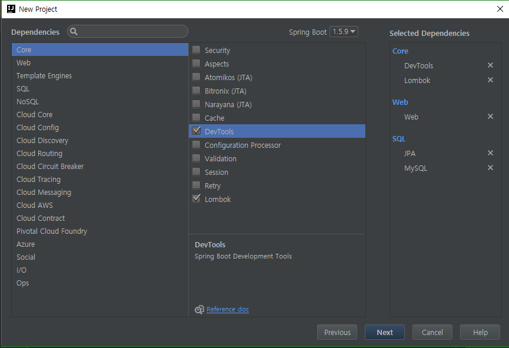

# Spring Data JPA 이용

---

# index

- <a href="#init">Boot Initializer</a>
- <a href="https://github.com/zacscoding/spring-boot-book/tree/master/boot03/src/main/java/org/zerock/persistence">쿼리 메소드 이용</a>
- <a href="https://github.com/zacscoding/spring-boot-book/tree/master/boot03/src/test/java/org/zerock/persistence"> 쿼리 테스트 코드 </a>
- <a href="https://github.com/zacscoding/spring-boot-book/blob/master/jpa.md#data-page"> Page<T> 메소드 정리</a>
- <a href="#query-dsl">Querydsl </a>

---

### Spring Boot  

  

---

### Querydsl 이용  

 

- pom.xml 라이브러리 & Maven 설정의 변경 및 실행
- Predicate의 개발
- Repository를 통한 실행

> pom.xml

<a href="https://github.com/zacscoding/spring-boot-book/blob/master/boot03/pom.xml">pom.xml</a>
<a href="http://www.querydsl.com/static/querydsl/4.0.1/reference/ko-KR/html_single/#d0e441">querydsl 한글 DOCS</a>

> IntellJ GenerateSource

pom.xml -> maven -> Generated Sources And Update Folders -> target/generated-sources/java 확인

> Predicate

<table>
  <tr>
    <th>메소드</th>  <th>설명</th>
  </tr>
  <tr>
    <td>long count(Predicate)</td>    <td>데이터 전체 개수</td>
  </tr>
  <tr>
    <td>boolean exist(Predicate)</td>    <td>데이터 존재 여부</td>
  </tr>
  <tr>
    <td>Iterable<T> findAll(Predicate)</td>    <td>조건에 맞는 모든 데이터</td>
  </tr>
  <tr>
    <td>Page<T> findAll(Predicate)</td>    <td>조건에 맞는 모든 데이터</td>
  </tr>
  <tr>
    <td>Iterable<T> findAll(Predicate, Sort)</td>    <td>조건에 맞는 모든데이터와 정렬</td>
  </tr>
  <tr>
    <td>T findOne(Predicate)</td>    <td>조건에 맞는 하나의 데이터</td>
  </tr>
</table>

> Repository Interface

<pre>
import org.springframework.data.querydsl.QueryDslPredicateExecutor;
import org.springframework.data.repository.CrudRepository;
import org.zerock.domain.Board;

public interface BoardRepositoryByQuerydsl extends CrudRepository&lt;Board,Long&gt;, QueryDslPredicateExecutor<Board> {

}
</pre>

> Test Code

<pre>
    @Test
    public void predicate() {
        String type = "t";
        String keyword = "17";

        BooleanBuilder builder = new BooleanBuilder();
        QBoard board = QBoard.board;
        // check search type
        if(type.equals("t")) {
            builder.and(board.title.like("%" + keyword + "%"));
        }

        // bno > 0
        builder.and(board.bno.gt(0L));

        // pageable
        Pageable pageable = new PageRequest(0,10);

        Page<Board> results = boardRepository.findAll(builder, pageable);

        System.out.println("## PAGE SIZE getSize() : " + results.getSize());
        System.out.println("## TOTAL PAGES getTotalPages() : " + results.getTotalPages());
        System.out.println("## TOTAL COUNT getTotalElements() : " + results.getTotalElements());
        System.out.println("## NEXT nextPageable() : " + results.nextPageable());
        List<Board> boards = results.getContent();
        boards.forEach(b -> {System.out.println(b);});
    }

</pre>
